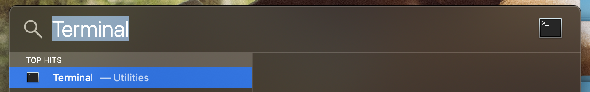

## Why?

Funny that my first blog post is on Magento, given that I have no idea how it actually works.

However a friend of mine was really struggling with setting it up, they asked for help and I wanted to help them.

This friend of mine is pretty damn excellent at everything they do, so I knew I'd need to bring my A-game to setting up a platform I don't know anything about.

What I found was not fun and not nice. Magento isn't at all beginner friendly, and hopefully that's something the magento community as a whole can address.

## Get Started

Open up your mac terminal press the cmd key (`⌘`) and the spacebar together (`⌘ space`) and type the word `Terminal`. It should be the first suggestion that pops up. Either double click the icon or just press enter.



### Homebrew

In the terminal check that you have homebrew installed.

```bash
which brew
```

If you see `brew not found` then copy and paste the following command from the [homebrew website](https://brew.sh/) into your terminal.

```bash
xcode-select --install
/usr/bin/ruby -e "$(curl -fsSL https://raw.githubusercontent.com/Homebrew/install/master/install)"
```

I'm using a beautiful terminal called [**hyper**](https://hyper.is/). If you want to install it now's as good a time as any.

```bash
brew cask install hyper
```

Later on we are going to need to edit some code so we'll also install an editor called [visual studio code](https://code.visualstudio.com). Either download it directly or install it with the following command.

```bash
brew cask install visual-studio-code
```

Now we're finally ready to install docker which will be used to contain all of the running environment which magento needs to get started.

Using docker means we can get all the benefits of a fully working installation of Magento without affecting our local development environment. Fun huh!

```bash
brew cask install docker
```

Now to open it use `cmd space` and type docker. It should be the first suggestion. Click to open. You may receive a warning saying that this is an application downloaded from the internet. Ignore that and proceed with opening the application.

<br>

### Special Thanks

None of this would be possible without the brilliant work of [Mark Shust](https://github.com/markshust) on [docker-magento](https://github.com/markshust/docker-magento). It's a brilliant tool for quickly setting up magento on your machine and he deserver all the plaudits. So please star the [repo](https://github.com/markshust/docker-magento) or send him your love.

That being said I did notice [one small issue](https://github.com/markshust/docker-magento/pull/132) when setting up Magento on my friends machine and for that reason we're going to use a slightly modified version of his scripts to get started.

### Install it already!

Let's get it done.

First run make sure `curl` is installed to your terminal. This is used to provide instructions for setting up a user.

```bash
brew install curl
```

Now in the terminal navigate to the folder in which you want the installation to be installed. Please note the files installed will be added to the folder and not a subdirectory. For demo purposes we'll create a folder called `Coding/magento-docker` in the home directory and then move to that directory.

Note that the tilde (`~/`) is a terminal shorthand for the current logged in users home directory. On the mac that is `/Users/{YOUR_USERNAME}`.

```bash
# Create the director (-p creates any missing intermediary directories as well)
mkdir -p ~/Coding/magento-docker

# Change into the directory
cd ~/Coding/magento-docker
```

Within this directory run the following command. Basically this command pulls down the required code and sets up your directory for the next steps.

Copy each of the following lines one by one. Lines starting with `#` can be ignored and are purely to explain what the following line is doing.

We've decided that the URL we're going to use is `https://magento2.test`

```bash
# Set up the repository
curl -s https://raw.githubusercontent.com/ifiokjr/docker-magento/temp-fix/lib/template | bash -s -- magento-2

# Download the magento source code
bin/download 2.3.0

# Add the local url we'll use to localhost. You will be prompted to enter your password.
echo "127.0.0.1 magento2.test" | sudo tee -a /etc/hosts
```

We now need to setup the MagentoMarketplace authentication by following this [link](https://devdocs.magento.com/guides/v2.0/install-gde/prereq/connect-auth.html)

Login into the mage

Open visual studio code copy `src/auth.json.sample` to `src/auth.json`. Then, update the username and password values with your Magento public and private keys, respectively.

At this point we're close to something - just a few more steps to go.

```bash
bin/start magento2.test
bin/cli composer update vertex/sdk
bin/setup magento2.test
open https://mangento2.test
```

For a breakdown on all the commands available simply follow this [link](https://github.com/markshust/docker-magento#custom-cli-commands).

<!-- ### Git

Next we need to setup git.

If you're getting tired of my style of writing you can just follow the setup [here](http://sourabhbajaj.com/mac-setup/Git/).

Install git

```bash
brew install git
```

Check it's installed  -->
